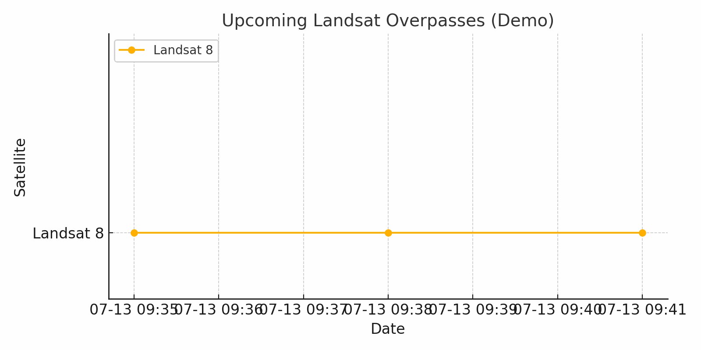

# WhenSat – Know When Satellites Pass Over You


[](LICENSE)
[](https://www.python.org/)
[](#calendar-export)


## Inspired by a simple question:<br/>
**When’s the next satellite overhead?** - Now you know.

**WhenSat** is a lightweight Python tool that helps you find out **when Landsat 8 or Landsat 9 satellites pass over a specific location on Earth**. It also lets you retrieve the **latest real acquisition date** and optionally **export upcoming passes to a calendar (.ics)**.

---

  
*An overpass calendar for Bologna generated with WhenSat*

---

## Features

- Input: any geographic coordinates (latitude, longitude)
- Automatic WRS-2 Path/Row resolution
- Retrieves latest actual acquisitions via USGS STAC API
- Predicts satellite overpasses using TLE and Skyfield
- Optional `.ics` calendar export
- Easy to extend to support other satellites (e.g. Sentinel-2)

---

## Installation

```bash
pip install skyfield geopandas shapely requests ics
```

# Basic Usage
```python
# Input your coordinates
latitude = 44.4949   # Bologna
longitude = 11.3426
```
Run the script:
```bash
python whensat.py
```

You’ll get:
- the date/time of the latest Landsat acquisition at that location
- list of upcoming satellite passes for the next N days

## Calendar export
If enabled, WhenSat can export future satellite passes as an .ics file:
```python
calendar_filename = "landsat_passes.ics"
```

You can import this file into:
- Google Calendar
- Apple Calendar
- Outlook
- Any standard calendar app

## Requirements
- Python 3.8+
- Internet connection (to fetch TLEs and metadata)
- OS: Linux, macOS, Windows

# TODO
- [] Add Sentinel-2 and MODIS support
- [] Add option to filter only daylight passes
- [] CSV export
- [] Thumbnail preview from USGS or Copernicus

  
